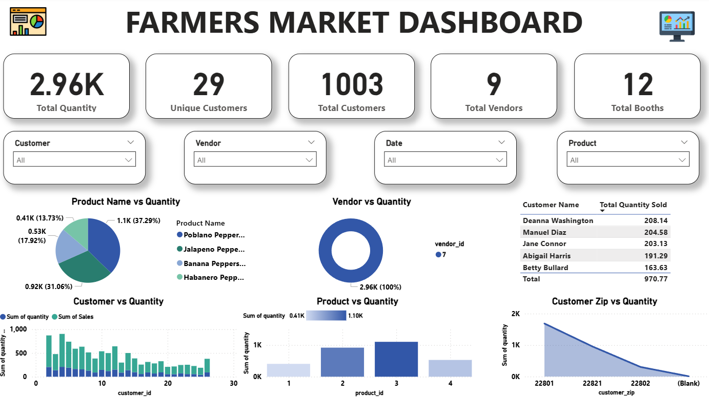
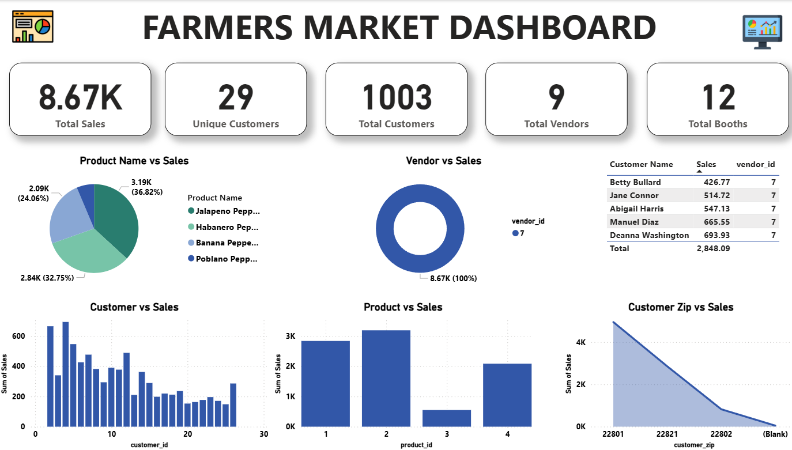

# Farmers Market Dashboard (Power BI)

## 📌 Project Overview
The **Farmers Market Dashboard** is an interactive Power BI project designed to analyze sales and quantity trends in a farmers market environment.  
It provides insights into customers, vendors, products, booths, and geographic distribution using dynamic visuals and filters.

This project focuses on both **Quantity-wise Analysis** and **Sales-wise Analysis**, helping stakeholders understand performance patterns and make data-driven decisions.

---

## 🎯 Objectives
- Analyze total sales and total quantity sold
- Identify top-performing products and vendors
- Understand customer purchasing behavior
- Compare quantity vs sales trends
- Analyze customer distribution by ZIP code
- Provide interactive filtering for better exploration

---

## 📊 Key Metrics
- Total Sales
- Total Quantity
- Unique Customers
- Total Customers
- Total Vendors
- Total Booths

---

## 📈 Dashboard Pages

### 1. Quantity Wise Analysis

This page analyzes the total quantity sold across products, customers, vendors, and ZIP codes using interactive visuals.

### 2. Sales Wise Analysis

This page focuses on revenue performance, highlighting top-selling products, customers, and vendors.

---

## 🚀 How to Use
1. Download the `.pbix` file
2. Open it using **Power BI Desktop**
3. Interact with slicers and visuals
4. Explore insights from both dashboard pages

---

## 📄 License
This project is for educational and portfolio purposes.
